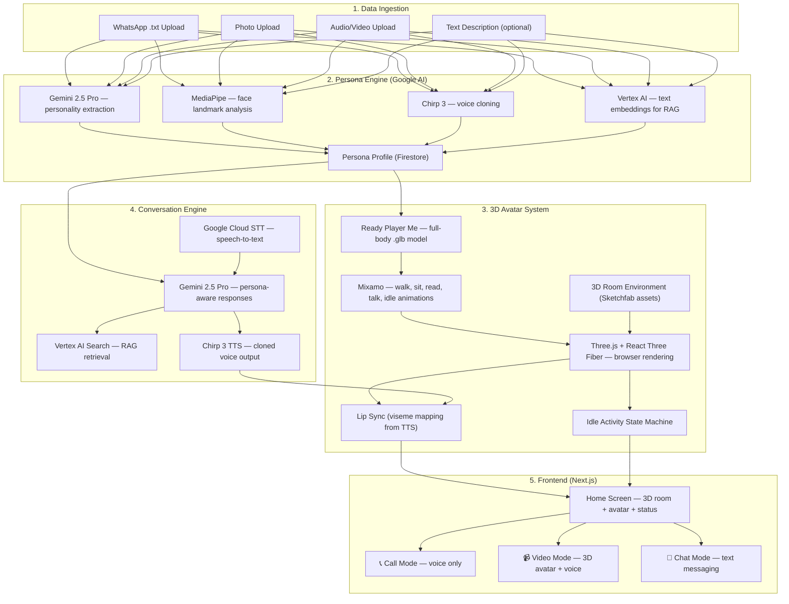
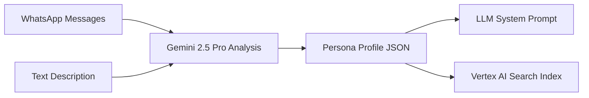

# Interactive AI Avatar App — Final Architecture Plan

## Vision

A daughter uploads her mother's WhatsApp chats, photos, and voice clips. The app creates a **live 3D avatar of the mother** that lives in a virtual room — walking around, reading, cooking — and the daughter can **call, video-call, or text chat** with her anytime.

---

## Inputs & Outputs Summary

### 📥 5 Inputs (All about the Mother)

| # | Input | Required? | Format | Purpose |
|---|---|---|---|---|
| 1 | WhatsApp Chat Export | ✅ Required | `.txt` file | Her words, slang, emoji, humor, topics |
| 2 | Person's Name | ✅ Required | Text | Filter her messages from group chats |
| 3 | Photos | ✅ Required | `.jpg` / `.png` | Face photos for 3D avatar generation |
| 4 | Audio/Video Clip | ✅ Required | `.mp4` / `.wav` (10s+) | Clone her voice |
| 5 | Text Description | ⭐ Optional | Text (by daughter) | Personality, quirks, background |

### 📤 3 Output Modes

| Mode | Experience |
|---|---|
| **📞 Call** | Voice-only — hear mom's cloned voice respond, like a phone call |
| **📹 Video** | Full 3D scene — mom's avatar in her room, turns to face you, talks with lip sync & gestures |
| **💬 Chat** | Text messaging — type back and forth, she responds in her style with emoji |

### 🏠 Idle State (When Daughter Isn't Interacting)

The avatar is always **alive** in her virtual room:

| Activity | Status Display |
|---|---|
| Sitting on couch reading | *"Mom is reading her favorite book 📖"* |
| Walking to kitchen | *"Mom is in the kitchen 🍳"* |
| Sitting relaxed | *"Mom is relaxing on the couch 🛋️"* |
| Watering plants | *"Mom is gardening 🌿"* |
| Standing by window | *"Mom is enjoying the view 🌅"* |

When daughter starts a Call/Video/Chat → avatar stops idle activity, turns to engage.

---

## System Architecture



---

## Component Deep Dive

### 1. Data Ingestion

**WhatsApp Parser:**
- Parses standard export: `[12/25/23, 10:30 AM] Mom: Good morning beta! ❤️`
- Filters by target person's name
- Extracts: message text, timestamps, emoji patterns, reply context
- Groups by conversation partner for relationship mapping

**Photo Upload:**
- Multiple face photos from different angles
- Primary photo → input for 3D avatar face generation

**Audio/Video Upload:**
- Extract clear speech segments for voice cloning
- Minimum 10 seconds of clear speech

---

### 2. Persona Engine



**Persona Profile contains:**
- **Personality:** Big Five traits, emotional tendencies, humor style
- **Vocabulary:** Common phrases, slang, pet names, emoji usage
- **Topics:** What she talks about most, opinions, interests
- **Relationship context:** How she talks to her daughter specifically
- **System prompt:** Instructions for Gemini to maintain this persona consistently

---

### 3. 3D Avatar System

| Component | Technology | Details |
|---|---|---|
| **Avatar Model** | Ready Player Me | Full-body `.glb` from profile picture |
| **Animations** | Mixamo (Adobe) | Walk, sit, read, wave, talk, idle, stand up |
| **3D Room** | Sketchfab free models | Cozy living room with couch, kitchen, bookshelf, window |
| **Renderer** | Three.js + React Three Fiber | WebGL, runs in browser, 60fps |
| **Lip Sync** | Viseme mapping | TTS audio → phonemes → mouth blend shapes |
| **Expressions** | Blend shapes | Emotion tag from Gemini → smile, thoughtful, surprised |
| **Idle System** | Finite State Machine | Cycles through activities with scripted waypoints |

**Idle Activity State Machine:**
```
IDLE → [random timer] → WALK_TO_COUCH → SIT → READ → [random timer] → STAND_UP → WALK_TO_KITCHEN → COOK → [random timer] → WALK_TO_WINDOW → LOOK_OUTSIDE → ...
```
When daughter initiates interaction → interrupt → `TURN_TO_CAMERA → ENGAGE`

---

### 4. Conversation Engine

| Step | Service | What Happens |
|---|---|---|
| **1. Input** | Google Cloud STT (Call/Video) or Text (Chat) | Daughter's words → text |
| **2. Context** | Vertex AI Search | Retrieve relevant WhatsApp messages + posts |
| **3. Generate** | Gemini 2.5 Pro | Respond in-character as mom, grounded in real data |
| **4. Emotion** | Gemini (structured output) | Tag response with emotion (happy, caring, funny, concerned) |
| **5. Voice** | Chirp 3 TTS | Synthesize response in mom's cloned voice |
| **6. Animate** | Three.js | Lip sync + expression + gestures on avatar |

**Per-mode behavior:**

| Mode | Input | Processing | Output |
|---|---|---|---|
| **📞 Call** | Mic → STT | Gemini + RAG | Cloned voice audio (no 3D) |
| **📹 Video** | Mic → STT | Gemini + RAG | Cloned voice + 3D avatar animation |
| **💬 Chat** | Typed text | Gemini + RAG | Text response (mom's style + emoji) |

---

### 5. Frontend Screens

#### Home Screen
- 3D room with mom's avatar doing idle activities
- Status bar: *"Mom is reading her favorite book 📖"*
- Three buttons: **Call** / **Video** / **Chat**

#### Call Mode
- Full-screen with mom's profile picture (blurred/ambient background)
- Voice waveform visualization
- End call button

#### Video Mode
- 3D room, mom stops idle activity, walks to camera position
- Talking with lip sync, gestures, expressions
- End call / mute buttons

#### Chat Mode
- WhatsApp-style messaging interface
- Mom sends text (in her style, with her emoji patterns)
- Chat bubbles, typing indicator

---

## Full Tech Stack

| Layer | Technology |
|---|---|
| **Frontend** | Next.js 14, React, React Three Fiber |
| **3D Engine** | Three.js, WebGL |
| **3D Avatar** | Ready Player Me API |
| **Animations** | Mixamo (walk, sit, read, talk, idle) |
| **3D Room** | Sketchfab assets (free models) |
| **Backend** | Python FastAPI |
| **LLM** | Gemini 2.5 Pro (Google AI Studio / Vertex AI) |
| **Voice Cloning + TTS** | Google Cloud TTS — Chirp 3 Instant Custom Voice |
| **Speech-to-Text** | Google Cloud Speech-to-Text (Chirp) |
| **Embeddings** | Vertex AI Text Embeddings |
| **Vector Search** | Vertex AI Search |
| **Face Analysis** | MediaPipe |
| **Database** | Cloud Firestore |
| **File Storage** | Google Cloud Storage |
| **Auth** | Firebase Auth |
| **Deployment** | Cloud Run (backend) + Vercel (frontend) |

---

## Implementation Phases

### Phase 1 — Foundation & Persona (Weeks 1-3)
- [ ] Next.js + FastAPI project scaffolding
- [ ] Onboarding wizard UI (5 input fields)
- [ ] WhatsApp `.txt` parser → structured messages
- [ ] Photo + audio/video upload handling
- [ ] Gemini persona extraction → personality JSON + system prompt
- [ ] Basic text chat with Gemini (using persona)
- [ ] Chat mode UI (WhatsApp-style bubbles)

### Phase 2 — 3D Avatar & Voice (Weeks 4-6)
- [ ] Ready Player Me → full-body `.glb` from photo
- [ ] Three.js + React Three Fiber avatar rendering
- [ ] 3D room scene (Sketchfab assets)
- [ ] Mixamo animations (walk, sit, read, idle, talk)
- [ ] Idle activity state machine
- [ ] Chirp 3 voice cloning from audio/video
- [ ] TTS → lip sync viseme mapping
- [ ] Home screen with live 3D room + status

### Phase 3 — Call & Video Modes (Weeks 7-8)
- [ ] Google Cloud STT integration (mic input)
- [ ] Call mode UI + voice conversation flow
- [ ] Video mode UI + avatar engagement transition
- [ ] Vertex AI embeddings + RAG retrieval
- [ ] Conversation memory (sliding window + summaries)
- [ ] Emotion tagging → avatar expression system

### Phase 4 — Polish & Deploy (Weeks 9-10)
- [ ] Firebase Auth (daughter login)
- [ ] Cloud Run + Vercel deployment
- [ ] Performance optimization (load times, 3D rendering)
- [ ] End-to-end testing all 3 modes
- [ ] UI polish — animations, transitions, dark mode

---

## Key Risks & Mitigations

| Risk | Mitigation |
|---|---|
| 3D avatar uncanny valley | Ready Player Me = stylized avatars (avoids uncanny valley) |
| Voice cloning needs clear audio | guide user; Chirp 3 needs only 10s |
| 3D room performance on mobile | Level-of-detail system; reduce poly count |
| Persona drift in long conversations | Strong system prompt + RAG grounding |
| Lip sync accuracy | Viseme mapping is proven tech; fine-tune timing |
